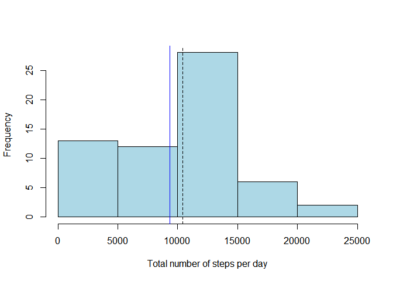
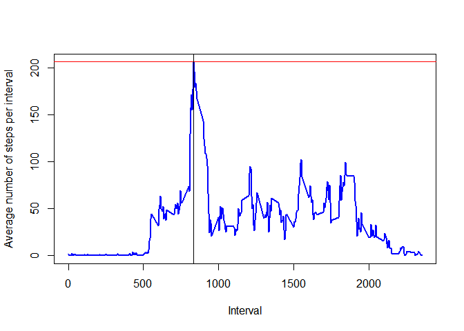
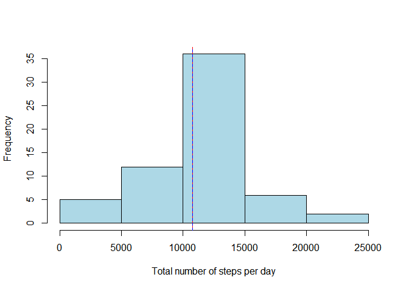
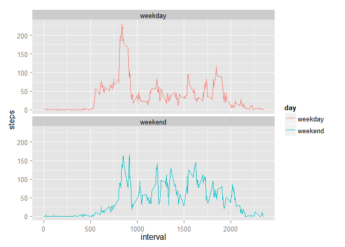

# Reproducible Research: Peer Assessment 1

**Global settings**


```r
echo = TRUE  # Code always visible
```

### Loading and preprocessing the data


```r
data <- read.csv("activity.csv", header=TRUE)
data$date=as.Date(data$date,"%Y-%m-%d")
```


### What is mean total number of steps taken per day?


```r
library(plyr)
spd <- tapply(data$steps, data$date, sum, na.rm=TRUE)
mean.spd <- mean(spd)
median.spd <- median(spd)
```

The mean total number of steps per day is 9354.2295 and the median is 10395.


**Histogram of the total number of steps taken each day**


```r
hist(spd, xlab="Total number of steps per day", main=NULL, col="lightblue")
abline(v=mean.spd, col = c("blue"))
abline(v=median.spd, col = c("black"), lty = 2)
```

 

### What is the average daily activity pattern?

```r
spi <- ddply(data, .(interval), summarize, steps = mean(steps, na.rm=TRUE))
max.spi <- max(spi$steps)
max.int <- spi[spi$steps==max(max.spi),1]
```

```r
plot(spi$interval,spi$steps, ylab="Average number of steps per interval",xlab="Interval", main=NULL, type="l", lwd=2, col="blue")
abline(h=max.spi, col = c("red"))
abline(v=max.int, col = c("black"))
```

 

The maximum number of steps per 5-minute interval on average is 206.1698 and it corresponds to the interval 835.


### Imputing missing values


```r
data.na <- dim(data[is.na(data$steps),])[1]
```

There are 2304 rows with missing values (NAs)

Copy of Data

```r
data.fill <- data
```


Fill NA values with that interval's step means

```r
row.names(spi)<- spi$interval
ind <- which(is.na(data.fill$steps))
data.fill[ind,1] <- spi[as.factor(data.fill[ind,3]),2]
```

### What is mean total number of steps taken per day?


```r
library(plyr)
spd1 <- tapply(data.fill$steps, data.fill$date, sum, na.rm=TRUE)
mean.spd1 <- mean(spd1)
median.spd1 <- median(spd1)
```

The new mean total number of steps per day is 1.0766 &times; 10<sup>4</sup> and the new median is 1.0766 &times; 10<sup>4</sup>.


```r
hist(spd1, xlab="Total number of steps per day", main=NULL, col="light blue")
abline(v=mean.spd1, col = c("red"))
abline(v=median.spd1, col = c("blue"), lty = 2)
```

 

**Do these values differ from the estimates from the first part of the assignment?**

The mean of the original data set was 9354.2295 and the mean of the imputed data set is 1.0766 &times; 10<sup>4</sup>.   

Also the median of the original data set 10395 is different from the median of the imputed data set 1.0766 &times; 10<sup>4</sup>.  

**What is the impact of imputing missing data on the estimates of the total daily number of steps?**  

After imputing the mean and median of the total steps per day are same.


### Are there differences in activity patterns between weekdays and weekends?

Create a date.time column that combines the date and interval columns.

```r
time <- formatC(data.fill$interval / 100, 2, format='f')
data.fill$date.time <- as.POSIXct(paste(data.fill$date, time),
                                 format='%Y-%m-%d %H.%M',
                                 tz='GMT')
```

Add a factor column for whether a day is a weekday or weekend


```r
day.type <- function(date) {
    if (weekdays(date) %in% c('Saturday', 'Sunday')) {
        return('weekend')
    } else {
        return('weekday')
    }
}
day.types <- sapply(data.fill$date.time, day.type)
data.fill$day <- as.factor(day.types)
```


```r
spiw <- ddply(data.fill, .(interval,day), summarize, steps = mean(steps, na.rm=TRUE))
max.spiw <- max(spiw$steps)
max.intw <- spiw[spiw$steps==max(max.spiw),1]
```


```r
library(ggplot2)
ggplot(data=spiw, aes(x=interval, y=steps, group=day)) + geom_line(aes(color=day))+ facet_wrap(~ day, nrow=2)
```

 

